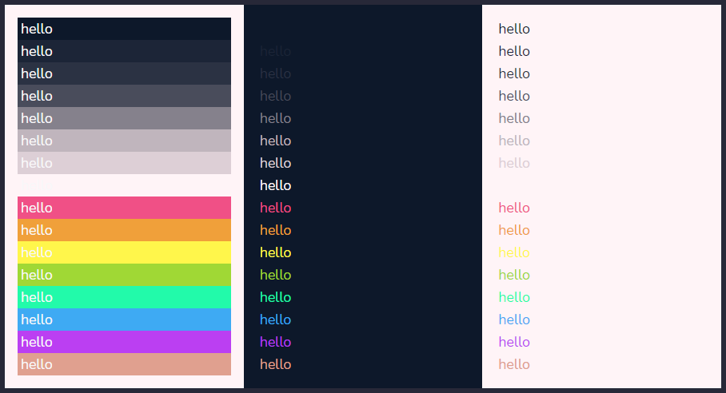

# Hi-Mage colorschemes

**Hi-Mage colorschemes** is a repository for Base16 & terminal colorscheme inspired from magical color palette, which designed for terminal & syntax highlighting.

## Terminal colorschemes

> Info: additional themes/colorschemes may added in the future.

| No  | Theme | Preview | Preview (Terminal) |
| --- | ----- | :-----: | :----: |
|  1. | Ara Green |  |  |
|  2. | Hanaka |  |  |
|  3. | Hayzard Moguri |  |  |
|  4. | Mageria |  |  |
|  5. | Marnetta |  |  |
|  6. | Purpuré |  |  |

Available in **_Xresources_** file on `xresources` directory and **_Windows Terminal_** colorschemes JSON ([`hi-mage-wt.json`](hi-mage-wt.json)) file.

For another terminal/editor theme, feel free to customize on [terminal.sexy](https://terminal.sexy/) or through [termcolors](https://github.com/stayradiated/termcolors).

## Base16 colorschemes

Available for use with syntax highlighting. Perfect to use with your favourite text editors, IDE, and code previewer (rouge and highlight.js).

### Hi-Mageria

YAML [(hi-mageria.yaml)](base16/hi-mageria/hi-mageria.yaml) | SASS/SCSS [(hi-mageria.scss)](base16/hi-mageria/hi-mageria.scss)

Color grid:

Color preview:

### Hi-Hanaka

YAML [(hi-hanaka.yaml)](base16/hi-hanaka/hi-hanaka.yaml) | SASS/SCSS [(hi-hanaka.scss)](base16/hi-hanaka/hi-hanaka.scss)

Color grid:

Color preview:

